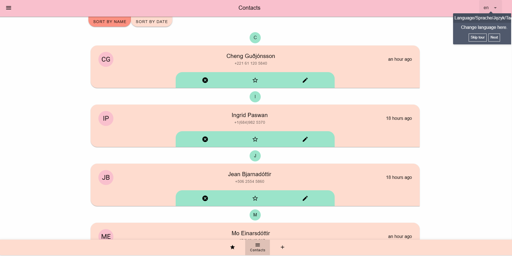
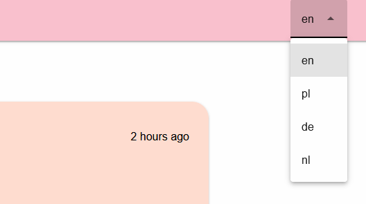
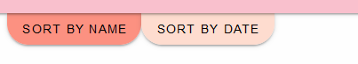
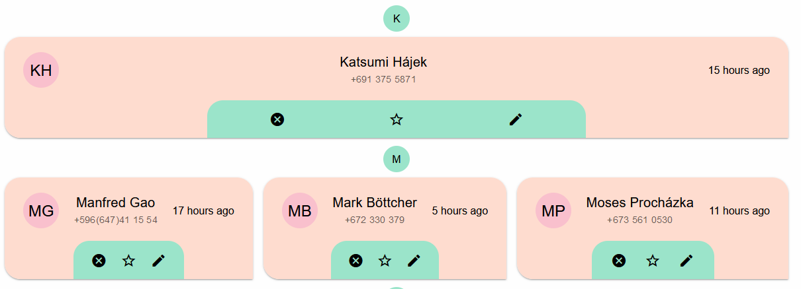
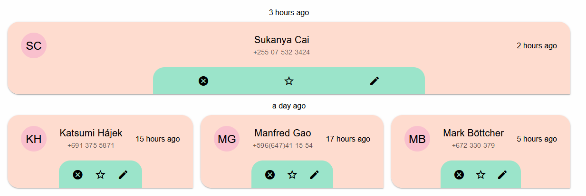
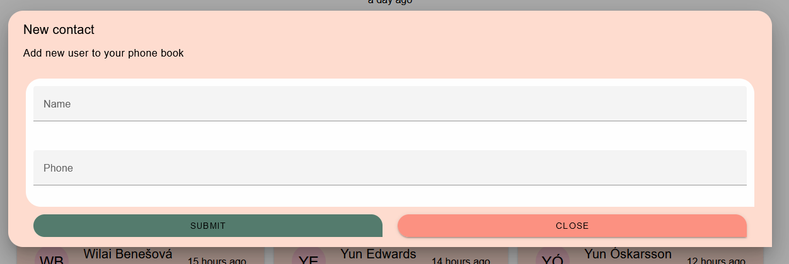
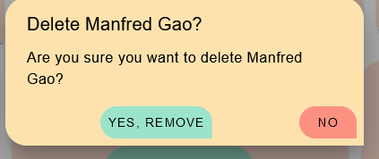
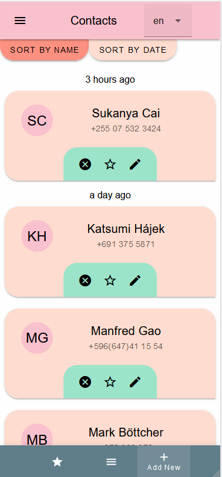
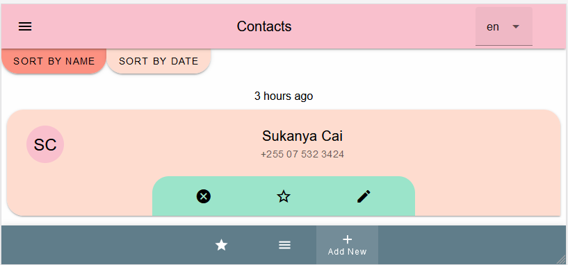

# Contacts

[Link to online App](https://wildcat-moral-yearly.ngrok-free.app/)

## Contents
* [Install/Run](front/README.md)
* [Useful Commands](front/src/Commands.md)
* [Components](front/src/components/Components.md)
  * [Dirs/AtomicDesign](front/src/components/DirStructure.md)
  * [Cypress](Readme/Cypress.md)
  * [StoryBook](Readme/Storybook.md)
* [Features](Readme/Features.md)
* [Technologies](Readme/Technologies.md) 

## See how cool this app is

> Thanks to vue-i18n you can change language

> you can sort contacts by name or date

> Nice card where you can edit or remove
>
> It shows you how long time ago contact was created

> Contact are grouped by 1st letter of name. So lovely

> Groups by created date

> Easy way to add contact

> Sometimes we have to remove contact, here it is fast and easy

> App looks impressive also on Mobile phones

> No matter in what direction you hold it
