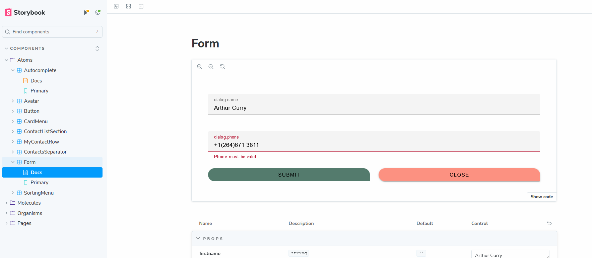

#### Storybook

You can check how each component look like and how does it act like thanks to Storybook.
Thanks to this it is way faster and easier to:
+ find bug
+ check how does each component works
+ make changes to component


In order to rub storybook use this command:
```shell
npm run storybook
```

> Storybook uses stories.ts extensions.
> All those index.stories.ts files are so-called stories
