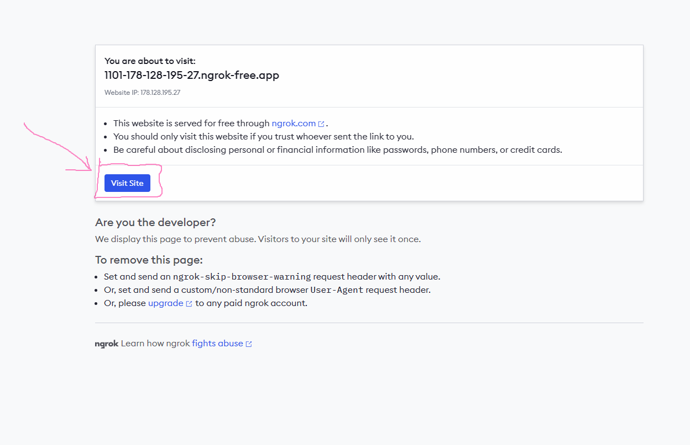

# How To Run the app?
## Online

[commands](src/Commands.md)


App is available here:
https://f59a-178-128-195-27.ngrok-free.app
__this address is temporary__

App is hosted on DigitalOcean. There I use Nginx to serve build app.
I use ngrock to redirect traffic to https, it is needed because service worker needs https to intercept. 

Todo:
- [ ] I am waiting for domain registration, app will be available on new address 
- [ ] CICD - there is problem with build on my server :), no enough ram

### How to run locally
If you want to install app locally use those commands in terminal:
```shell
cat .env.example >> .env
npm install
npm run build 
npm run serv:build
```
You may meet some problems with service workers(browser may stop them).
Looks like it doesn't work on Firefox and Opera on localhost.
On Google Chrome works fine. 

### Dev mode
You can also run in dev mode:
```shell
npm run serve
```
> but here it looks like service workers doesn't work at all. 

You could also try to use server from exampleBackend and bypass serviceWorker.

Todo:
- [ ] Docker


