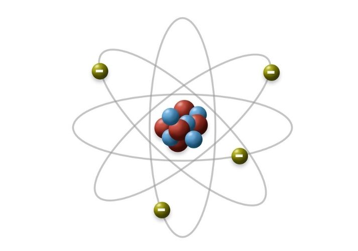

#### Atomic Design

Components are split to small parts, so-called atoms. You can find them in :
> src/components/atoms

Atoms are connected to molecules. They are bigger components and you can find them in
> src/components/molecules

Organisms are even bigger blocks build by Molecules and Atoms. They can be find in:
> src/components/organisms

This way of splitting components made them more reusable and more findable.
Moreover, thanks to this approach most components are small and have short code.
You can read more about Atomic Design Pattern here:
https://atomicdesign.bradfrost.com/chapter-2/

Todo
* some components may be in wrong category
